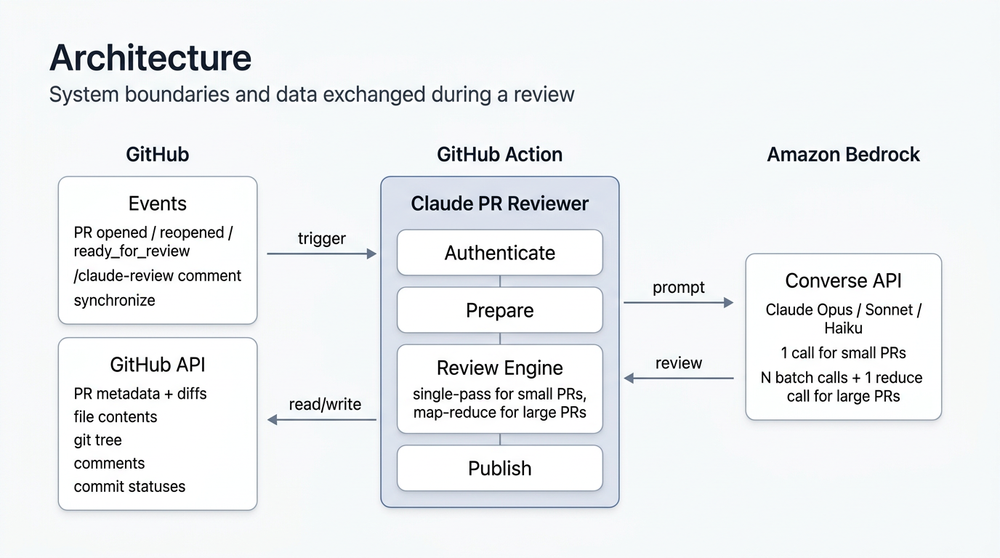
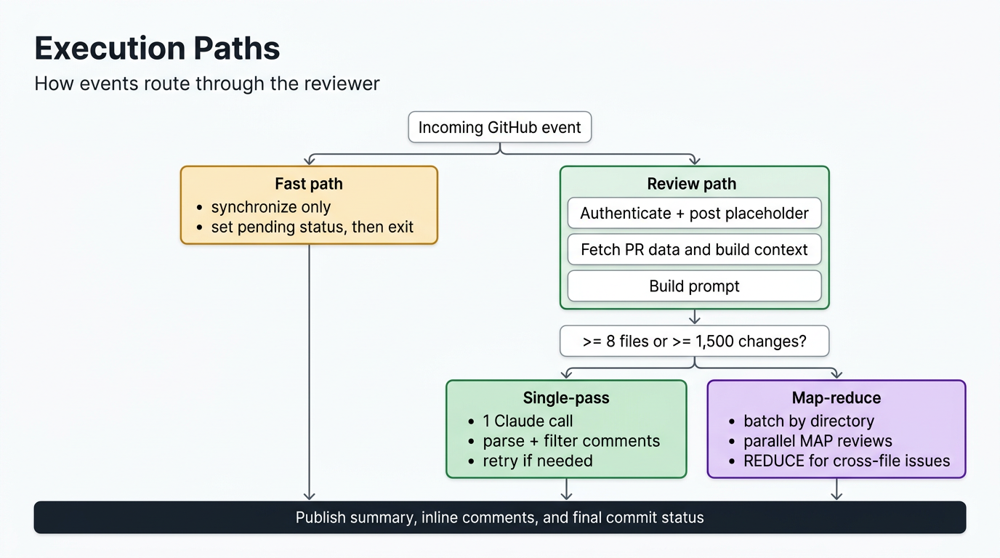
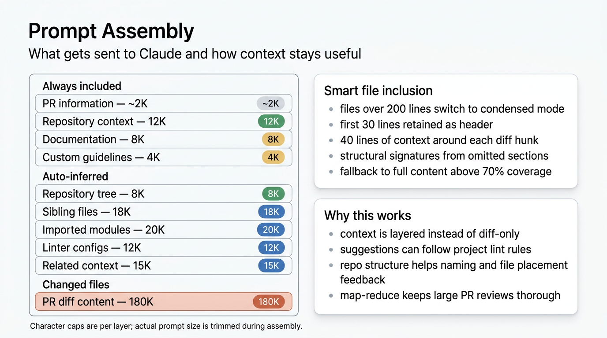

# Claude Bedrock PR Reviewer

AI-powered pull request reviews using Claude (Anthropic) via Amazon Bedrock. Provides senior-engineer-level review comments with inline suggestions, design feedback, and automatic repo context awareness — all from a single Python script with zero dependencies.

<p align="center">
  
</p>

## Features

- **Automatic reviews** on every PR (opened, reopened, ready for review)
- **On-demand reviews** via `/claude-review` comment for re-reviewing after new commits
- **Map-reduce pipeline** — handles large PRs (8+ files or 1500+ changes) with parallel batch reviews and cross-file consolidation
- **Smart token optimization** — 30-40% token savings via expanded diff context, structural signatures, and intelligent truncation
- **Full repository awareness** — directory tree, sibling files, and imported modules so Claude understands your project structure, coding patterns, and internal APIs
- **Linter-aware suggestions** — fetches your project's linter/formatter configs (64+ patterns across 10+ languages) so every `suggestion` block respects your rules
- **Custom guidelines** — optional `.github/claude-review.md` for repo-specific review instructions
- **Inline code suggestions** with GitHub's native suggestion blocks (one-click apply)
- **5 severity levels** — critical, warning, suggestion, design, nitpick — each with distinct icons
- **Senior-level review checklist** — security, concurrency, edge cases, resource management, test coverage, API contracts, design, and dead code
- **Comment deduplication** — skips duplicate comments on re-review so you don't get the same feedback twice
- **Instant feedback** — posts a placeholder comment immediately while Claude analyzes
- **Version label and AI disclaimer** — every comment shows the reviewer version and an AI-generated content notice
- **Merge gate** — sets a commit status (`Claude Bedrock PR Review`) that can be required in branch protection rules
- **Smart invalidation** — new commits automatically set the status to "pending" so stale reviews don't block merges
- **Draft PR aware** — skips draft PRs to avoid wasting API calls
- **Zero dependencies** — uses only Python's standard library (no `pip install`)

## Setup

### 1. Secrets and variables

`CLAUDE_REVIEWER_APP_PRIVATE_KEY` should be set as an **organization-level** secret so it's available to all repos automatically (**Settings > Secrets and variables > Actions** at the org level).

The remaining secrets can be set at the org or repo level:

| Secret | Level | Required | Description |
|--------|-------|----------|-------------|
| `CLAUDE_REVIEWER_APP_PRIVATE_KEY` | Org | Yes | The GitHub App's private key (`.pem` contents) |
| `CLAUDE_API_URL` | Org or Repo | Yes | Bedrock converse endpoint URL (see example below) |
| `CLAUDE_API_TOKEN` | Org or Repo | Yes | Bearer token for the Bedrock API |

Example `CLAUDE_API_URL`:

```
https://bedrock-runtime.us-east-1.amazonaws.com/model/us.anthropic.claude-sonnet-4-20250514-v1:0/converse
```

### 2. GitHub App

The action uses a GitHub App for its bot identity. You can use the shared App (ID `2914873`) if you have access to its private key, or create your own.

**Option A: Use the shared App**

Ask your team lead for the private key (`.pem` file) and install the App on your repository.

**Option B: Create your own App**

1. Go to **GitHub** > **Settings** > **Developer settings** > **GitHub Apps** > **New GitHub App**
2. Fill in:
   - **Name:** Any unique name (e.g. "Claude PR Reviewer - YourTeam")
   - **Homepage URL:** Your repo URL
   - **Webhook:** Uncheck "Active" (not needed)
   - **Permissions:**

| Permission | Access | Why |
|------------|--------|-----|
| Contents | Read | Fetch file contents and config files |
| Pull requests | Read & Write | Post review comments |
| Issues | Read & Write | Post summary comments |
| Commit statuses | Read & Write | Set the merge gate status |

3. Click **Create GitHub App** and note the **App ID** from the settings page
4. Scroll to **Private keys** > **Generate a private key** — saves a `.pem` file
5. Go to **Install App** (left sidebar) and install it on your org/repos
6. Store the `.pem` contents as the `CLAUDE_REVIEWER_APP_PRIVATE_KEY` secret
7. Pass your App ID via the `app-id` input in your workflow:

```yaml
- uses: adobe-rnd/claude-pr-reviewer@v1
  with:
    app-id: 'YOUR_APP_ID'
    app-private-key: ${{ secrets.CLAUDE_REVIEWER_APP_PRIVATE_KEY }}
    claude-api-url: ${{ secrets.CLAUDE_API_URL }}
    claude-api-token: ${{ secrets.CLAUDE_API_TOKEN }}
```

### 3. Workflow file

Create `.github/workflows/ai-pr-review.yml`:

```yaml
name: AI PR Review (Claude via Bedrock)

on:
  pull_request:
    types: [opened, synchronize, reopened, ready_for_review]
  issue_comment:
    types: [created]

permissions:
  contents: read
  pull-requests: write

jobs:
  ai_pr_review:
    runs-on: ubuntu-latest
    if: >-
      (github.event_name == 'pull_request' && github.event.pull_request.draft == false) ||
      (github.event_name == 'issue_comment' &&
       github.event.issue.pull_request &&
       contains(github.event.comment.body, '/claude-review') &&
       github.event.comment.author_association != 'NONE')
    steps:
      - name: Claude Bedrock PR Review
        uses: adobe-rnd/claude-pr-reviewer@v1
        with:
          app-private-key: ${{ secrets.CLAUDE_REVIEWER_APP_PRIVATE_KEY }}
          claude-api-url: ${{ secrets.CLAUDE_API_URL }}
          claude-api-token: ${{ secrets.CLAUDE_API_TOKEN }}
```

That's it. The action handles everything else.

## Architecture

The reviewer is a single Python script (~2600 lines, zero dependencies) that runs as a composite GitHub Action. It communicates with two external systems:

- **GitHub API** — reads PR metadata, changed files, file contents, config files, and existing comments; writes summary comments, inline review comments, and commit statuses
- **Amazon Bedrock** — sends the assembled prompt to Claude via the Converse API and parses the JSON response

### Event handling

| Event | Behavior |
|-------|----------|
| PR opened / reopened / ready for review | Posts a placeholder comment, runs a full review, sets commit status to `success` |
| New commits pushed (`synchronize`) | Sets commit status to `pending` (invalidates previous review). No new review runs automatically. |
| `/claude-review` comment | Runs a full review on the current PR head. Deduplicates against existing comments. Only works for users with repo association. |

### Review output

1. **Summary comment** — overview of the PR, list of changes, file table, and count of inline comments by severity
2. **Inline comments** — posted on the relevant lines in the diff, with optional `suggestion` blocks for one-click fixes
3. **Commit status** — `Claude Bedrock PR Review` on the head commit (`success`, `pending`, or `error`)

Every comment includes the reviewer version (e.g. `v1.3.0`) and an AI-generated content disclaimer.

## Review flow

<p align="center">
  
</p>

The review follows a 12-step pipeline:

1. **PR event triggered** — GitHub webhook fires on open/reopen/ready/comment
2. **Generate GitHub App token** — secure authentication via `actions/create-github-app-token`
3. **Post placeholder comment** — immediate feedback via curl (no Python needed)
4. **Set commit status to pending** — merge gate activated
5. **Fetch PR metadata** — title, description, head SHA
6. **Fetch changed files** — paginated diffs and file statuses
7. **Build context layers** — repo configs, docs, guidelines, tree, siblings, imports, linter configs
8. **Build prompt** — assemble all context + changed files (up to ~219K characters)
9. **Call Claude via Bedrock** — Converse API, 180s timeout, bearer token auth
10. **Parse JSON response** — extract summary + comments array
11. **Filter and deduplicate** — validate against diff lines, remove duplicates
12. **Post review to GitHub** — summary comment, inline comments, commit status

If the review returns 0 comments on a PR with 150+ additions, a second-pass review is triggered with a diff-only prompt to catch anything missed.

```
PR triggered
     │
     ▼
Fetch all changed files from GitHub API
(filename, status, patch, changes, additions, deletions)
     │
     ├─ removed files ──► dropped everywhere
     │
     ▼
Compute: reviewable_count, total_changes
     │
     ├─ reviewable_count == 0 ──► "deletions only" early exit
     │
     ▼
┌─────────────────────────────────────────────────────┐
│  use_map_reduce = files >= 8  OR  changes >= 1500   │
└─────────────────────────────────────────────────────┘
          │                          │
         NO                         YES
          │                          │
          ▼                          ▼
   Single Claude call          Group files into batches
   budget: 180k chars          (by directory, max 8/batch)
          │                          │
          │                    ┌─────┴──────┐
          │                    │  Per batch  │  (up to 5 parallel)
          │                    │  budget:    │
          │                    │  120k chars │
          │                    └─────┬──────┘
          │                          │
          └──────────┬───────────────┘
                     │
                     ▼
           Per-file content decision (same logic both paths):
           ┌──────────────────────────────────────────────┐
           │  changes > 800?                              │
           │    YES → diff only (patch)                   │
           │    NO  → fetch full source from contents API │
           │          → smart file block:                 │
           │            · file ≤ threshold lines?         │
           │              full source + patch             │
           │            · file > threshold lines?         │
           │              imports + ±context lines + patch│
           │          → if block > budget → fallback to   │
           │            diff only                         │
           │          → still > budget → skip             │
           └──────────────────────────────────────────────┘
                     │
                     ▼
           Context fetched alongside files:
           · repo_context  (configs: package.json, pyproject, etc.)
           · repo_docs     (README, CONTRIBUTING, etc.)
           · guidelines    (CLAUDE_REVIEW_GUIDELINES.md etc.)
           · linter_config (eslint, prettier, ruff, etc.)
           · repo_tree     (full file tree)
           · sibling_files (other files in same dirs, unmodified)
           · imported_files (local modules imported by changed files)
           · related_context (test files, build configs for changed files)
                     │
          ┌──────────┴───────────────┐
         NO                         YES (map-reduce)
          │                          │
          ▼                          ▼
   → 1 Claude call            MAP: N Claude calls (parallel)
     all files + context      each batch: its files + context
          │                   (sibling/import/related per batch)
          │                          │
          │                          ▼
          │                   REDUCE: 1 Claude call
          │                   input: all batch results +
          │                          all diffs (150k char budget)
          │                   output: deduplicated, validated,
          │                           + new cross-file comments
          │                          │
          │                    reduce failed? → concat all batch
          │                    comments as fallback
          │                          │
          └──────────┬───────────────┘
                     │
                     ▼
           Filter comments to valid diff lines only
                     │
          ┌──────────┴──────────┐
         NO (single)           YES (map-reduce)
          │                     └──► done
          ▼
   Zero comments AND additions >= threshold?
     YES → second-pass retry with stricter prompt
           (diff-only, no full source)
     NO  → done
                     │
                     ▼
           Post review to GitHub
```

## Large PR support (map-reduce)

For PRs with **8+ files** or **1500+ total changes**, the reviewer automatically activates a map-reduce pipeline instead of the single-pass review:

```
Small PR  →  single-pass review (unchanged)

Large PR  →  MAP:     parallel batch reviews (5-8 files each, full context)
          →  REDUCE:  cross-file consolidation (dedup, validate, enhance)
          →  filter + post (shared path)
```

### How it works

1. **Grouping** — files are grouped into batches by directory affinity (files in the same directory stay together), with up to 8 files per batch
2. **Map phase** — each batch is reviewed in parallel via `ThreadPoolExecutor`, with batch-specific sibling files and imports for local context, plus full PR scope awareness
3. **Reduce phase** — a consolidation pass deduplicates comments, validates suggestions, and detects cross-file issues (broken contracts, mismatched interfaces, missing test updates)
4. **Shared context** — repo configs, docs, guidelines, and the directory tree are computed once and reused across all batches via a thread-safe file content cache

### Cost and latency

| PR Size | Mode | API Calls | Est. Cost | Est. Latency |
|---------|------|-----------|-----------|-------------|
| 500 lines, 4 files | Single-pass | 1 | ~$0.15 | ~30s |
| 2K lines, 12 files | Map-reduce | 3+1 = 4 | ~$0.55 | ~50s |
| 5K lines, 25 files | Map-reduce | 4+1 = 5 | ~$1.00 | ~60s |

Latency stays low because map batches run in parallel — wall time is `max(batch) + reduce`, not `sum(batches) + reduce`.

### Failure handling

- If some batches fail, the review is posted as **partial** with a warning in the summary and `failure` commit status to block merges
- Deletions-only PRs (zero reviewable files) exit early with a "no reviewable files" status

## Context window

<p align="center">
  
</p>

The reviewer assembles a rich context window for Claude, organized into budget-controlled layers:

| Layer | Budget | Description |
|-------|--------|-------------|
| PR information | ~2K | Title + description (first 2,000 characters) |
| Repository context | 12K | Language configs (`pyproject.toml`, `package.json`, `tsconfig.json`, `go.mod`, etc.) |
| Repository tree | 8K | Full directory listing via Git Trees API, with focused subtrees for large repos |
| Sibling files | 18K | Up to 5 files total, with at most 3 per directory (same extension, ranked by name similarity, min 0.3 relevance) |
| Imported modules | 20K | Local modules referenced by `import`/`require()` in changed files |
| Linter/formatter configs | 12K | Active linter rules from 64+ config file patterns |
| Project documentation | 8K | `README.md`, `CONTRIBUTING.md`, `ARCHITECTURE.md`, `CLAUDE.md`, `.cursorrules` |
| Custom guidelines | 4K | `.github/claude-review.md` — team-specific review instructions |
| Related context | 15K | Auto-inferred test files and build configs |
| Changed files (PR diff) | 180K | Full content + unified diff (smart context for large files) |

### Smart file inclusion

For files over 200 lines, full file content is replaced with an optimized representation:

- **Header + imports** (first 30 lines) for module-level context
- **Expanded diff hunks** (40 lines of context around each changed region)
- **Structural signatures** (`def`, `class`, `fn`, `struct`, `interface`, etc.) from omitted sections so Claude still sees the file's shape

If the expanded context covers >70% of the file, the full content is sent instead. Estimated savings: **40-60% of file content tokens**.

### Smart context extraction

- **`package.json`** — only essential keys are extracted (name, scripts, dependencies, engines, workspaces); noise like browserslist/jest/babel config is dropped
- **`README.md`** (context files) — truncated at the 3rd `##` heading to keep the project description while dropping installation/license/contributing boilerplate

### Repository structure

The reviewer fetches the full directory tree (via the Git Trees API — a single API call) so Claude can see the entire project layout. This enables feedback like:

- "Your other services in `src/services/` use snake_case — this new file should too"
- "This file belongs in `src/utils/`, not `src/helpers/` based on your existing structure"
- "You already have a `BaseRepository` class — this new repository should extend it"

Noisy directories (`node_modules`, `__pycache__`, `dist`, `build`, `.git`, etc.) are automatically excluded.

### Sibling files

For each directory containing changed files, the reviewer fetches up to 5 existing source files total, with at most 3 from any single directory. Files are matched by extension and ranked by name similarity (minimum 0.3 relevance score). Barrel files like `__init__.py` and `index.js` are filtered out. This lets Claude compare the PR's code against established patterns — class structure, error handling, naming conventions, and architecture.

### Import resolution

The reviewer parses `import` / `from ... import` / `require()` statements in the changed files and fetches the referenced local modules. This lets Claude verify that the changed code uses internal APIs correctly — right parameter types, proper return value handling, and interface compliance.

## Linter-aware suggestions

The reviewer automatically fetches linter and formatter configuration files from your repository so that every `suggestion` block in the review respects your project's rules. A suggestion that introduces a linter violation is treated as worse than no suggestion at all.

**Supported tools** (64+ config file patterns):

| Language | Tools |
|----------|-------|
| Python | ruff, flake8, pylint, mypy, isort, bandit, pyre |
| JavaScript / TypeScript | ESLint, Prettier, Biome, Deno |
| Go | golangci-lint |
| Rust | rustfmt, clippy |
| Ruby | RuboCop |
| Java / Kotlin | Checkstyle, Scalafmt |
| Swift | SwiftLint |
| PHP | PHP-CS-Fixer, PHPCS, PHPStan |
| C/C++ | clang-format, clang-tidy |
| General | Stylelint, markdownlint, EditorConfig |

When the Git Trees API is available, all 64+ patterns are checked via fast set lookup. If the tree is unavailable (truncated or failed), a high-signal subset of ~17 files is checked as fallback.

## Custom review guidelines

For anything auto-detection can't cover, create a **`.github/claude-review.md`** (or `.claude-review.md` at the repo root) with free-form instructions:

```markdown
- This project targets Python 3.11+
- We use SQLAlchemy 2.0 style (not legacy 1.x patterns)
- Prefer `pathlib` over `os.path`
- Ignore import ordering — handled by isort pre-commit hook
- This is a Spring Boot 3.x project on Java 21 — use Jakarta namespace, not javax
- Skip architecture/design suggestions, focus only on correctness
```

These instructions are injected directly into the review prompt and take precedence over default review behavior.

## What it reviews

The reviewer works through a comprehensive checklist for every changed file:

| Category | What it checks |
|----------|---------------|
| **Correctness** | Null dereferences, off-by-one errors, integer overflow, empty collection handling, boundary values |
| **Security** | Hardcoded secrets, SQL injection, XSS, path traversal, SSRF, insecure deserialization, overly broad permissions |
| **Concurrency** | Race conditions, missing locks, deadlock potential, TOCTOU, unsafe publication |
| **Resource management** | Unclosed connections/handles, missing context managers, memory leaks, unbounded caches |
| **Error handling** | Swallowed exceptions, generic catch-alls, missing cleanup in error paths, unhelpful error messages |
| **Test coverage** | Missing tests for new logic, weak assertions, missing edge case tests, flaky test patterns |
| **API contracts** | Breaking changes, missing input validation, inconsistent error formats |
| **Design** | Algorithm/data structure choices, language-specific optimizations, architectural decisions, library suggestions, scalability concerns |
| **Dead code** | Commented-out code, unreachable code, unused variables/imports/functions, dead feature-flag branches, leftover debug statements |

## Severity levels

| Severity | Icon | Use case |
|----------|------|----------|
| Critical | :rotating_light: | Bugs, security vulnerabilities, data loss risks |
| Warning | :warning: | Error handling gaps, race conditions, resource leaks |
| Suggestion | :bulb: | Code improvements, better patterns, simplifications |
| Design | :triangular_ruler: | Architecture, algorithms, language optimizations, infra choices |
| Nitpick | :mag: | Minor observations, optional improvements |

## Optional: require review before merge

To use Claude's review as a merge gate:

1. Go to **Settings > Branches > Branch protection rules**
2. Enable **Require status checks to pass before merging**
3. Search for and add `Claude Bedrock PR Review`

When new commits are pushed, the status is automatically set to `pending`, requiring either a new `/claude-review` or a new PR event to pass.

## Supported models

The action auto-detects the Claude model from the Bedrock endpoint URL and displays it in the review footer:

- Claude Opus 4.6, 4.5, 4
- Claude Sonnet 4.6, 4.5, 4
- Claude Haiku 4.6, 4.5, 4
- Claude 3.7 Sonnet, 3.5 Sonnet, 3.5 Haiku
- Claude 3 Opus, 3 Sonnet, 3 Haiku

## Action inputs

| Input | Required | Description |
|-------|----------|-------------|
| `app-id` | No | GitHub App ID (defaults to `2914873`) |
| `app-private-key` | Yes | GitHub App private key (`.pem` contents) |
| `claude-api-url` | No* | Bedrock converse endpoint URL |
| `claude-api-token` | No* | Bedrock API bearer token |

*`claude-api-url` and `claude-api-token` are not required for `synchronize` events (which only set a pending status). For all other events, both are required.
